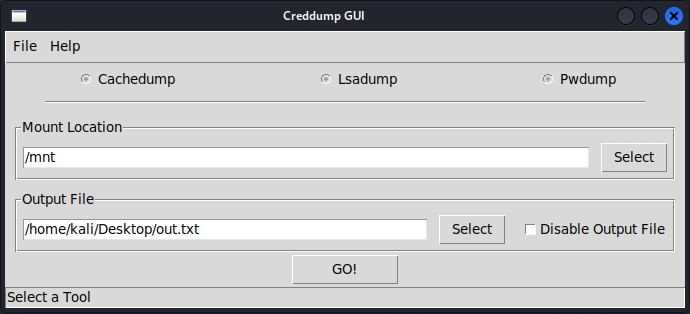

# Creddump GUI


This is my GUI wrapper for the original 'creddump' program available
at: 

https://code.google.com/p/creddump/

Credit to Ronnie Flathers (@ropnop) for the additional modifications. Tested on Kali Linux 2021.4

### Dependencies
tkinter
```
$ sudo apt-get install python3-tk
```
